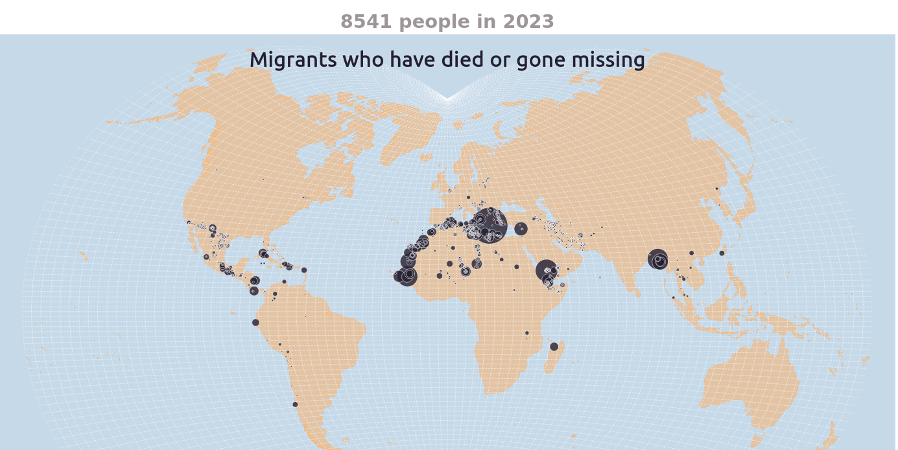

# Explore datasets

Mini project to look up datasets of interest (human rights, environment...) and create data graphics and share visuals!
=> VIEW [WEB PAGE](https://explore-datasets.cargo.site/)

## Land defenders
Uses data published by [Global Witness](https://globalwitness.org) in 2022 that records lethal attacks against land and environmental defenders between 2012 and 2021.

See full [Jupyter notebook](https://elle-est-au-nord.github.io/explore-datasets/land_defenders/land-defenders.html) or the notebook [dashboard view](https://eleonore9-notebooks.hf.space/voila/render/land-defenders.ipynb)

From a data exploration in Jupyter Lab to data visuals for social media:

## Journalists and media workers
Looks into journalists and media workers killed on the job worldwide between 2018 and 2023 using the [Committee to Protect Journalists (CPJ)](https://cpj.org/data/killed/?status=Killed&motiveConfirmed%5B%5D=Confirmed&motiveUnconfirmed%5B%5D=Unconfirmed&type%5B%5D=Journalist&type%5B%5D=Media%20Worker&start_year=1992&end_year=2024&group_by=year) dataset.

See [Observable notebook](https://observablehq.com/@eleonore9/number-of-journalists-killed-in-2018)

## Missing migrants
Explores data made available by the [International Organization for Migration (IOM)](https://missingmigrants.iom.int/downloads) on migrants (including refugees and asylum-seekers) who have died or gone missing around the world.

See [Observable notebook](https://observablehq.com/d/9bd19632957d127f)

