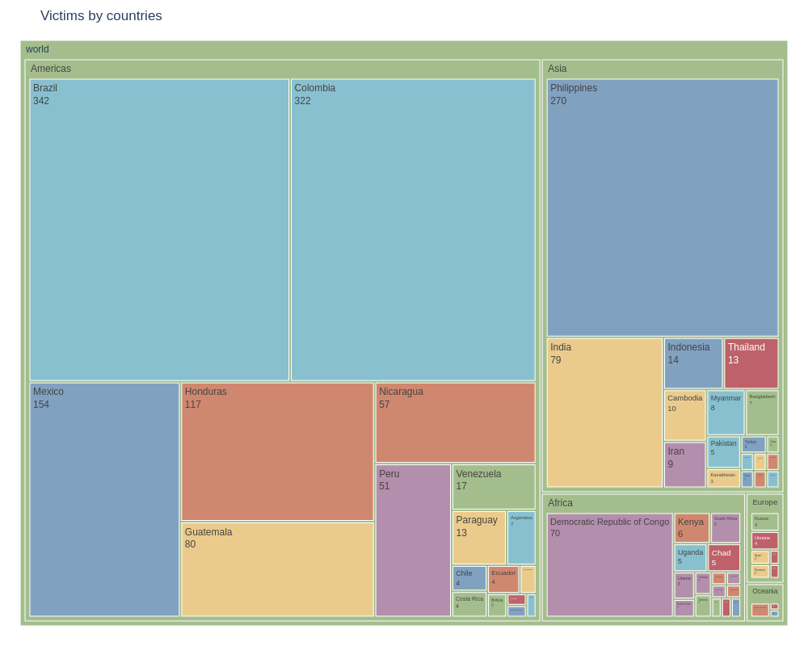

# Explore datasets

Mini project to look up datasets of interest (data exploration, data viz)

## Land defenders
Uses data published by [Global Witness](globalwitness.org) in 2022 that records lethal attacks against land and environmental defenders between 2012 and 2021.

View Github page [here](https://elle-est-au-nord.github.io/explore-datasets/)