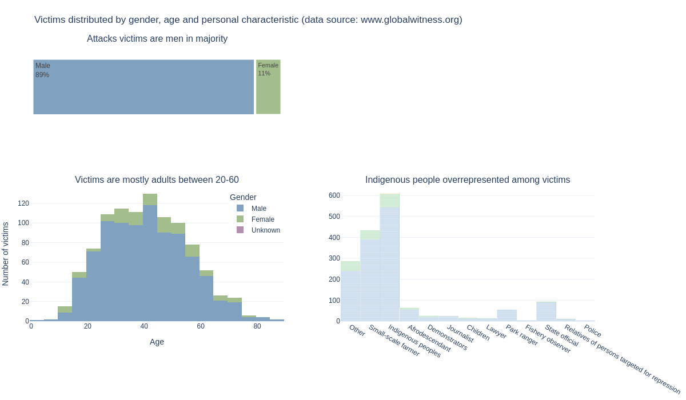
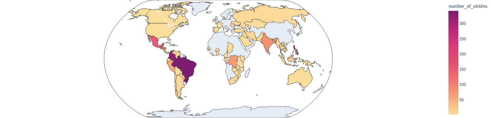
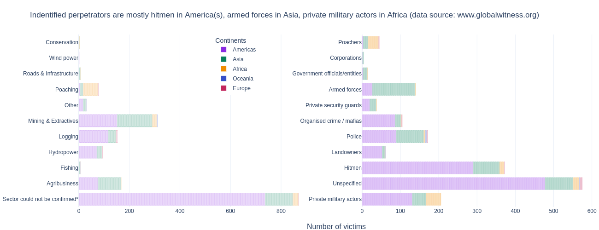

# Land defenders
## Lethal attacks against land and environmental defenders between 2012 and 2021
source: Global Witness (www.globalwitness.org)

[GITHUB PAGE](https://Elle-est-au-nord.github.io/explore-datasets/)

Data analysis [Notebook](https://elle-est-au-nord.github.io/explore-datasets/land_defenders/land-defenders.html)

Folium/Leaflet map [Notebook](https://elle-est-au-nord.github.io/explore-datasets/land_defenders/folium_map.html) | [HTML](https://elle-est-au-nord.github.io/explore-datasets/land_defenders/land-defenders-map.html)

___

Last month (August 2023) I watched a compelling reportage on the news about National Park rangers in Colombia and the local indigenous community risking their lives to prevent illegal deforestation in a protected area.
This led me to go download this small dataset on attacks against land defenders on the Global Witness website, and explore it.

From this dataset exploration and other reportages/documentaries/news articles, I'm now interested to look up more data regarding large tropical rainforest areas (the Amazon, the Congo bassin and Southeast Asia), extractive or agricultural activities and the danger to the local populations (including local activists) and the journalists who cover these stories.

___

## Summary

The Global Witness data show attacks against mainly men part of indigenous populations and/or small-scale farmer in Latin America (Brazil and Colombia mostly) and Southeast Asia (mostly the Philippines).

The causes are often not identified or confirmed, but unsurprisingly mining, logging and agribusiness are in the top 3 of confirmed industry drivers.

___

See more [here](https://Elle-est-au-nord.github.io/explore-datasets/)