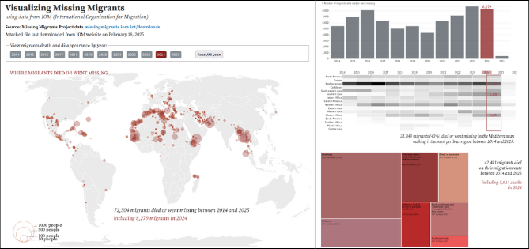

# Visualizing Missing Migrants

Latest IOM dataset update: February 18, 2025

* See D3.js + html [WEBPAGE](https://elle-est-au-nord.github.io/explore-datasets/missing_migrants/)
* See D3.js Observable [NOTEBOOK](https://observablehq.com/d/68b689c8063a0396)

___

While browsing projects created on Observable, a [project](https://observablehq.com/@neocartocnrs/dead-and-missing-migrants) by Nicolas Lambert called "Dead and Missing Migrants in the Mediterranean" caught my attention. 

This is how I discovered the IOM database on missing migrants and forked the project mentionned above to visualize migrants missing worldwide on a [notebook](https://observablehq.com/d/9bd19632957d127f).

